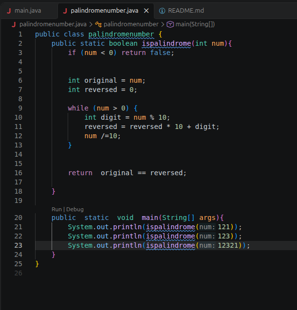
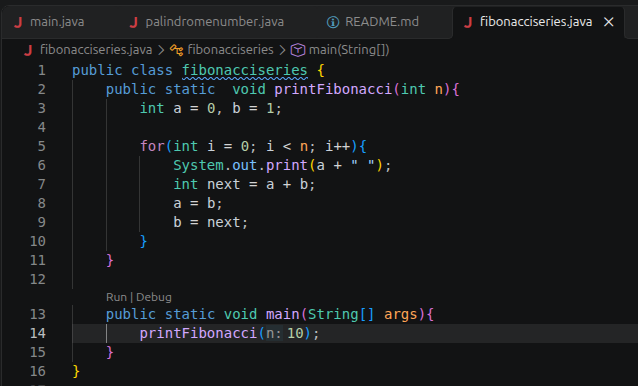
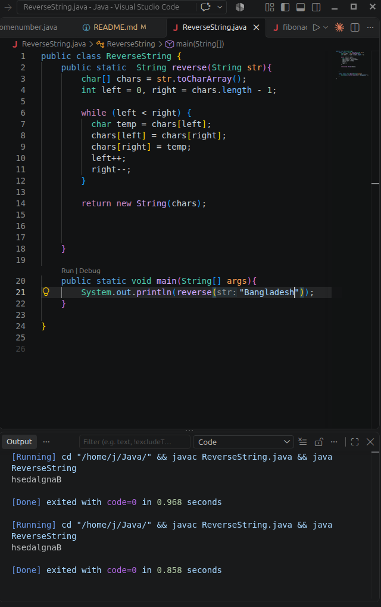
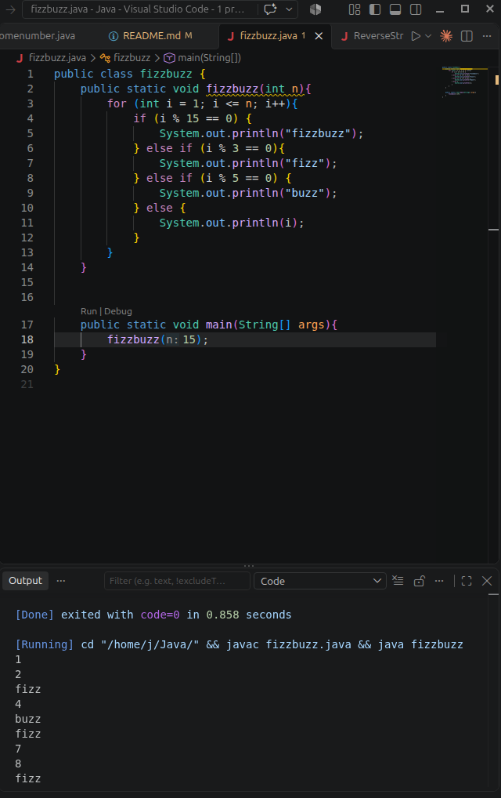
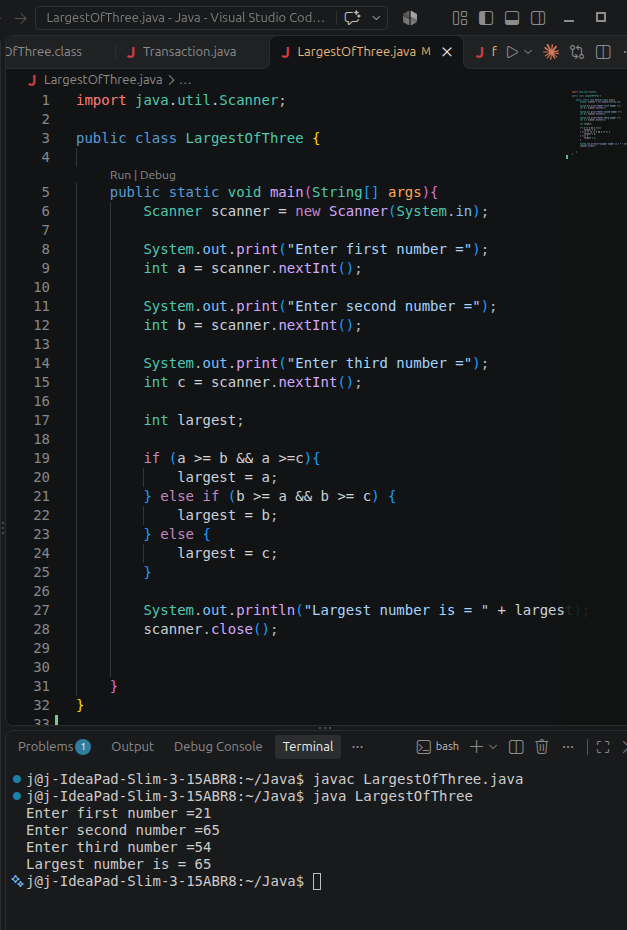

## 1. Palindrome Number

### Check if a number is a palindrome (121, 12321)

### Explanation: The number was reversed and compared with the original number. 

## 2. Fibonacci Series

### Problem: Print the first n Fibonacci numbers.

### Explanation: At each step, the next number is obtained by adding the previous two numbers.

## 3. String Reverse

### Problem: Print a string in reverse.

### Explanation: Swapping is performed from the beginning and the end using the two-pointer technique.

## 4 . Fizz Buzz

### Problem: Print numbers from 1 to n. If divisible by 3, print "Fizz"; if by 5, print "Buzz"; if by both, print "FizzBuzz".

### Explanation: It is important to check 15 (3×5) first; otherwise, the output will be incorrect.

## 5. Simple if-else (Beginner Friendly)

### Java program to find the largest of three numbers.